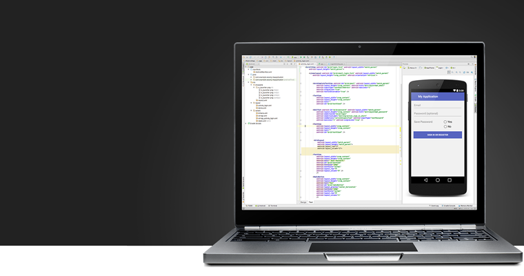

#Android Studio 简介

------

Android Studio 是一个为Android平台开发程序的开发环境，基于 intelliJ IDEA.，它为开发者提供了集成的android开发工具用于开发和调试。2013年5月16日由Google产品经理Ellie Powers在Google I/O大会上发布的，可供开发者免费使用,而且有google长期技术支持(google已经停止对ADT的更新，这里还是强烈推荐大家使用AS作为开发ide)。

####VS  eclipse
+ 1、Google推出的
毫无疑问，这个是它的最大优势，Android Stuido是Google推出，专门为Android“量身订做”的，是Google大力支持的一款基于IntelliJ IDEA改造的IDE，这个应该能说明为什么它是Android的未来

+ 2、速度更快
Eclipse的启动速度、响应速度、内存占用一直被诟病，相信大家这点应该深有体会，而且经常遇到卡死状态。Studio不管哪一个方面都全面领先Eclipse

+ 3、UI更漂亮
I/O上演示的那款黑色主题真是太棒了，极客范，Stuido自带的Darcula主题的炫酷黑界面实在是高大上，相比而言Eclipse下的黑色主题太low了

+ 4、更加智能
提示补全对于开发来说意义重大， Studio则更加智能，智能保存，从此再也不用每次都 Ctrl + S了。熟悉Studio以后效率会大大提升。

+ 5、整合了Gradle构建工具
Gradle是一个新的构建工具，自Studio亮相之处就支持Gradle，可以说Gradle集合了Ant和Maven的优点，不管是配置、编译、打包都非常棒。

+ 6、强大的UI编辑器
Android Studio的编辑器非常的智能，除了吸收Eclipse+ADT的优点之外，还自带了多设备的实时预览，相对这对Android开发者来说简直是神器啊。

+ 7、内置终端
Studio内置终端，这对于习惯命令行操作的人来说简直是福音啊，再也不用来回切换了，一个Studio全部搞定。

+ 8、更完善的插件系统
Studio下支持各种插件，如Git、Markdown、Gradle等等，你想要什么插件，直接搜索下载。

+ 9、完美整合版本控制系统
安装的时候就自带了如GitHub, Git, SVN等流行的版本控制系统，可以直接check out你的项目。

大家看完以上是不是很动心呢，优点是很多，但是大家学习的时候会遇到很多问题，如Studio和Eclipse的目录结构、快捷键等等完全不一样，需要适应一段时间。

但是相信Google会越来越完善的，学习成本与适应阶段是我们做技术一直要保持的心态，一旦上手相信你要离不开它了。

#### 版本记录
http://tools.android.com/download/studio/canary（含各种测试版）

| 版本号 |
| :-------------: |
|1.2正式版|
|1.2 RC3|
| 1.2 RC2|
| 1.2 RC|
| 1.2 Beta3 |
| 1.2 Beta2 |
| 1.2 Beta |
| 1.2 Preview 4 |
|  1.2 Preview 3 |
| 1.2 Preview 2|
| 1.2 Preview 1 |
| 1.1 正式版 |
| 1.1 RC1 |
| 1.1 Beta4 |
| 1.1 Beta3 |
| 1.1 Beta2|
|  1.1 Beta |
|1.1 Preview 2|
|1.1 Preview 1|
|1.0.2|
| 1.0.1|
|1.0正式版|
|1.0 RC4|
|1.0 RC2|
|1.0 RC1|
|0.9.3|
|0.9.2|
|0.9.1|
|0.9.0|
|0.8.14|
|0.8.13|
|0.8.12|
|0.8.11|
|0.8.10|
|0.8.9|
|0.8.8|
|0.8.7|
|0.8.6|
|0.8.5|
|0.8.4|
|0.8.3|
|0.8.2|
|0.8.1|
|0.8.0|
|0.6.1|
|0.6.0|
|0.5.9|
|0.5.8|

####链接
官方下载地址（需翻墙）
http://developer.android.com/sdk/index.html

推荐国内镜像网站
http://www.jikexueyuan.com/resources/