# 一、Android Studio 的下载与安装


---

## 准备：
+ 安装好JDK，配置好环境变量；


+ 下载安装包
 * 官方下载地址（需翻墙）
   http://www.jikexueyuan.com/resources/
 * 推荐国内镜像网站
   http://www.androiddevtools.cn/#android-studio


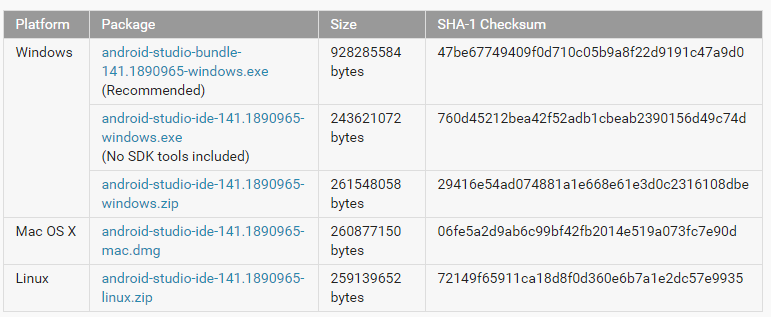

更具自己的操作系统选取安装包下载。


##安装


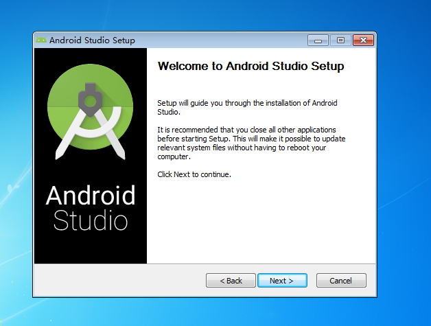


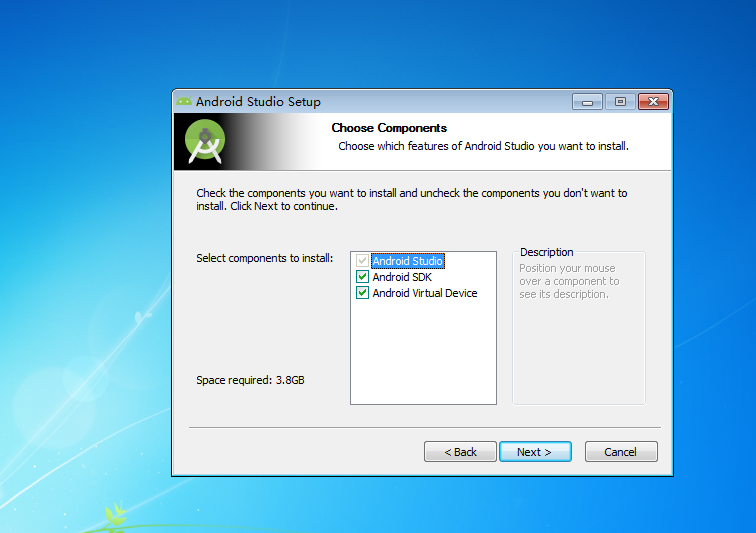

选取安装内容，以图上为例分别是分别是studio开发环境，sdk和虚拟机，根据自己的需求安装


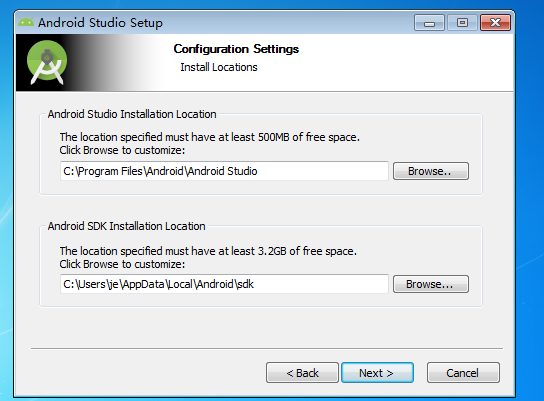

选取安装路径（android studio的路径和android sdk的路径）


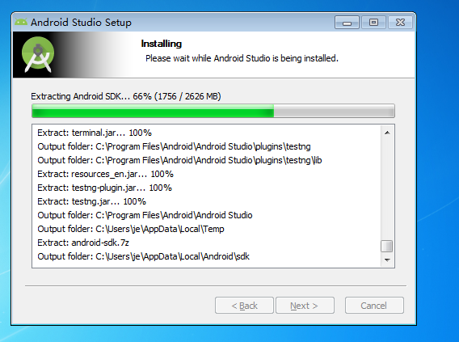

等待安装


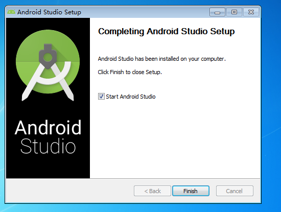

安装完毕


## SDK配置

### 在线配置

#### 初次打开配置


打开android studio


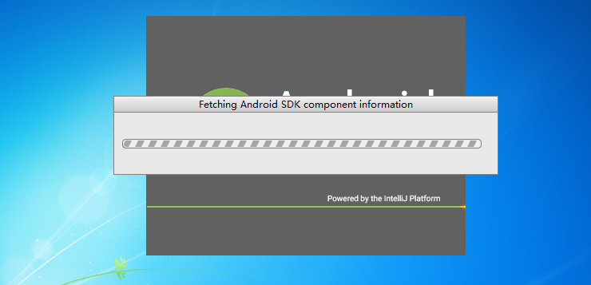

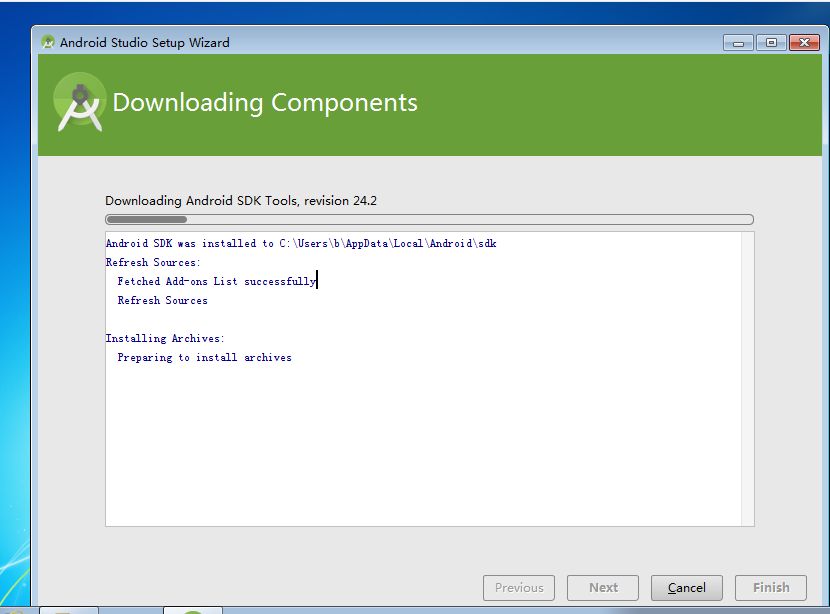

初次打开后会检查SDK更新，好在google对SDK进行了处理，可以在线更新，等待更新结束就可以了。

+ 但如果网速不够，会一直卡在这里很久。
+ 这里修改一下：编辑器打开bin目录的idea.properties，增加一行：    disable.android.first.run=true，（mac平台的右键安装包->Show Package Contents 就找到bin目录），这样就可以跳过每次打开都检查SDK更新。

#### 通过SDK manager进行更新
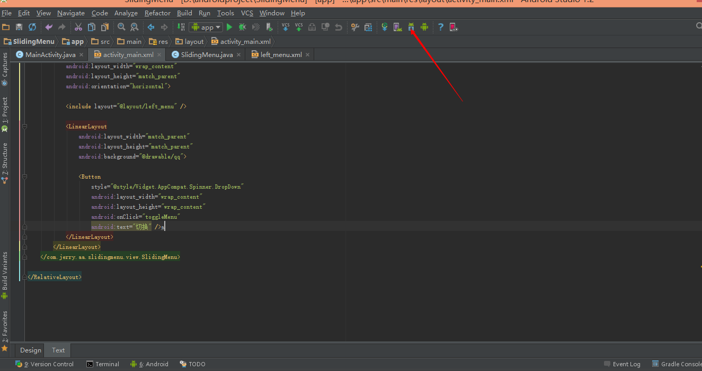

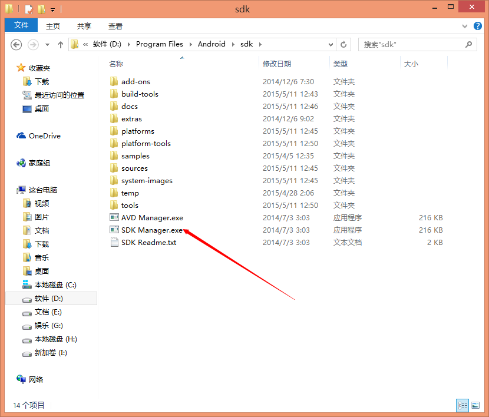

通过以上任意一种方法就可以打开SDK Manager


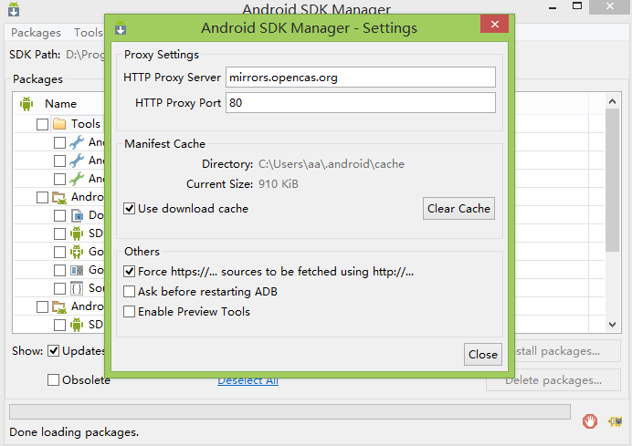

理论上是可以直接更新SDK，但考虑到网速问题我们还是更换镜像源。

+ 1、启动 Android SDK Manager ，打开主界面，依次选择『Tools』、『Options...』，弹出『Android SDK Manager - Settings』窗口；

+ 2、在『Android SDK Manager - Settings』窗口中，在『HTTP Proxy Server」和「HTTP Proxy Port』输入框内填入上面镜像服务器地址(不包含http://，如下图)和端口，并且选中『Force https://... sources to be fetched using http://...』复选框。设置完成后单击『Close』按钮关闭『Android SDK Manager - Settings』窗口返回到主界面；

+ 3、依次选择『Packages』、『Reload』。
+ 

```
Android SDK在线更新镜像服务器

中国科学院开源协会镜像站地址:

IPV4/IPV6: http://mirrors.opencas.cn 端口：80

IPV4/IPV6: http://mirrors.opencas.org 端口：80

IPV4/IPV6: http://mirrors.opencas.ac.cn 端口：80

上海GDG镜像服务器地址:

http://sdk.gdgshanghai.com 端口：8000

北京化工大学镜像服务器地址:

IPv4: http://ubuntu.buct.edu.cn/ 端口：80

IPv4: http://ubuntu.buct.cn/ 端口：80

IPv6: http://ubuntu.buct6.edu.cn/ 端口：80

大连东软信息学院镜像服务器地址:

http://mirrors.neusoft.edu.cn 端口：80
```


### 离线配置

#### 下载SDK
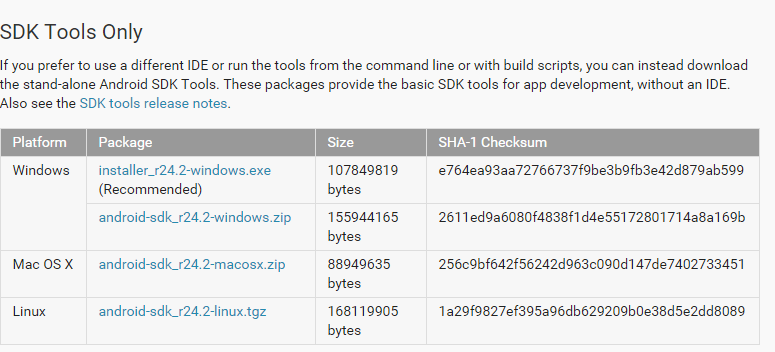

下载对应的sdk，解压；

#### 初次配置

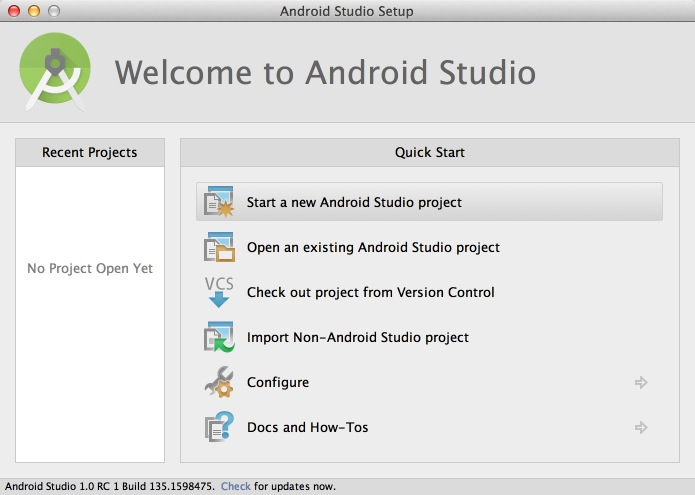

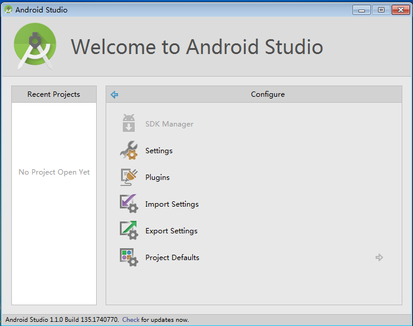


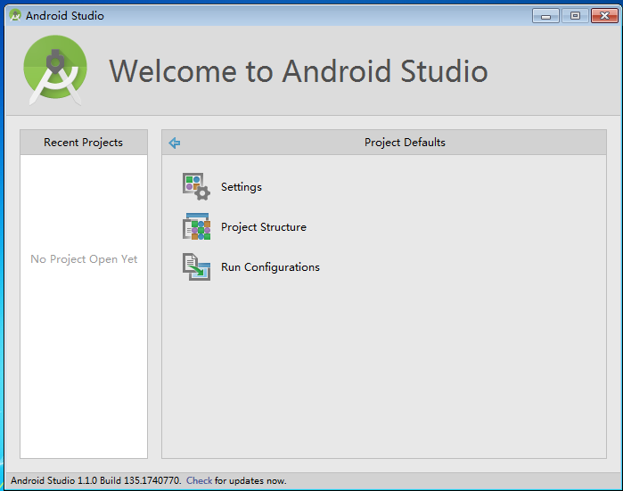


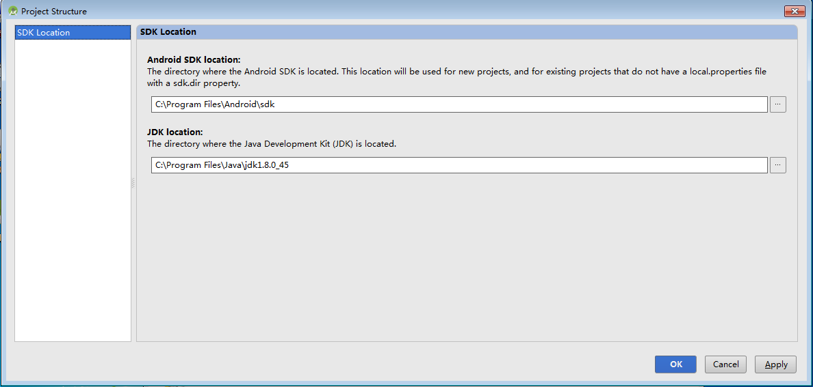

依次进入目录Configure->Project Defaults->Project Structure，配置SDK目录（即解压SDK对应的目录）

#### 更换JDK，SDK目录

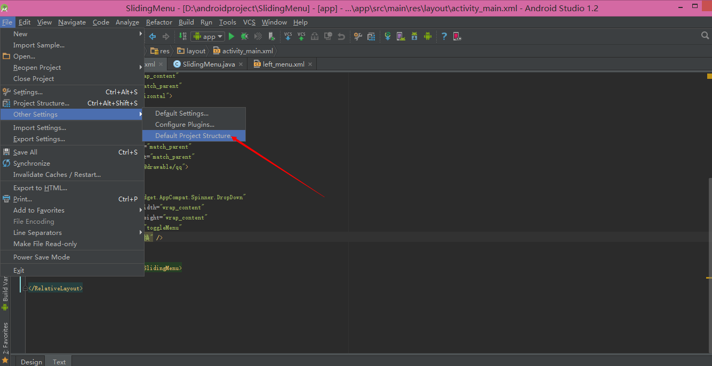


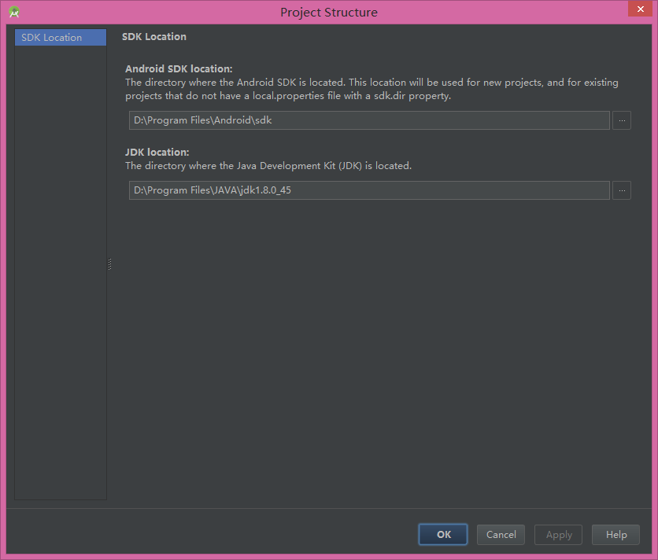


进入file -> others setting ->default project struct


## 补充：ubuntu下的JAVA环境配置

ubuntu自带的是OpenJDK,这里还是推荐大家使用OrcalJDK,AS推荐使用的就是OrcalJDK.OpenJDK在编译的时候还是会出现一些问题的.

### 配置顺序

java环境搭建->下载安装android studio->下载配置SDK->创建快捷方式

####(一)添加软件源

* 先卸载openjdk
* 
```shell
$ sudo apt-get purge openjdk* 
```
* 添加PPA(Personal Package Archives)
```shell
$ sudo apt-get install software-properties-common
$ sudo add-apt-repository ppa:webupd8team/java
$ sudo apt-get update
```

* 安装jdk
```shell
$ sudo apt-get install oracle-java8-installer
```


####(二)自行配置
####下载
oracle官网下载JDK压缩包(tar.gz格式)
http://www.oracle.com/technetwork/java/javase/downloads/jdk8-downloads-2133151.html


####创建java目录
 
```shell
 $sudo mkdir -p /usr/local/java
 $cd /usr/local/java 
 $sudo cp 下载目录下的jdk压缩包 当前目录下的jdk压缩包 
```
####解压
```shell
$sudo tar -zxvf jdk-8u25-linux-i586.tar.gz//解压
$sudo tar -zxvf jdk-8u25-linux-i586.tar.gz // 删除已解压的压缩包(注意名字对应) 
```

####配置环境变量
```shell
$sudo gedit /etc/profile 
```
在末尾加上如下部分：
JAVA_HOME=/usr/local/java/jdk1.8.0_25
PATH=$PATH:$HOME/bin:$JAVA_HOME/bin export 
JAVA_HOME export PATH 
保存退出;

###配置ubuntu的JDK和JRE的位置 
    
```shell
$sudo update-alternatives --install "/usr/bin/java"  "java" "/usr/local/java/jdk1.8.0_25/bin/java" 1
$sudo update-alternatives --install "/usr/bin/javac"  "javac" "/usr/local/java/jdk1.8.0_25/bin/javac" 1  
$sudo update-alternatives --install "/usr/bin/javaws"  "javaws" "/usr/local/java/jdk1.8.0_25/bin/javaws" 1
```

####配置Oracle为系统默认JDK/JRE 

```shell
$sudo update-alternatives --set java /usr/local/java/jdk1.8.0_25/bin/java 
$sudo update-alternatives --set javac /usr/local/java/jdk1.8.0_25/bin/javac 
$sudo update-alternatives --set javaws /usr/local/java/jdk1.8.0_25/bin/javaws
```

配置完成后，执行如下命令使其立即生效。 


```
. /etc/profile 
```

#### 验证是否配置成功

环境变量配置完成后，在终端命令行中键盘敲入： java –version，出现jdk版本信息，而不是出错信息，即表示配置成功！ 


### 2.android studio 的下载与安装

### 下载

### 解压安装

```shell
$sudo tar -zxvf 压缩包
```

解压完成后，进入bin/studio.sh，即为打开方式输入，直接在终端输入studio.sh即可打开；


### 3.下载配置SDK

谷歌提供的linux版本的android studio并没有集成SDK,这需要我们自己下载，网址如上一致：


###环境变量配置

```shell
cd ~/software/  说明：进入到保存SDK目录 
tar -zxvf android-sdk_r23.0.2-linux.tgz //解压sdk 
echo 'export ANDROID_HOME="'$HOME'/software/android-sdk-linux"' >> ~/.bashrc   //设置android环境变量 
echo 'export PATH="$PATH:$ANDROID_HOME/tools:$ANDROID_HOME/platform-tools"' >> ~/.bashrc //设置android环境变量 
echo 'export JAVA_CMD="/usr/local/java/jdk1.8.0_25/bin/java"' >> ~/.bashrc //设置java
 ```


